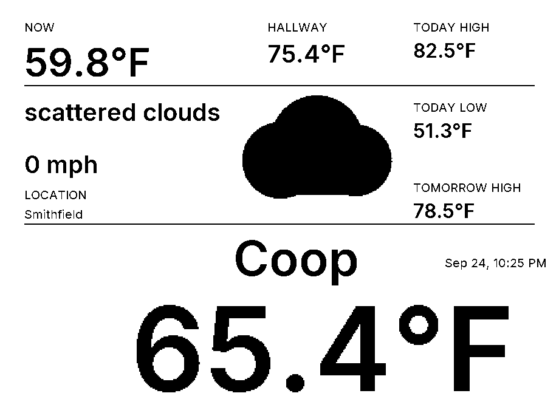
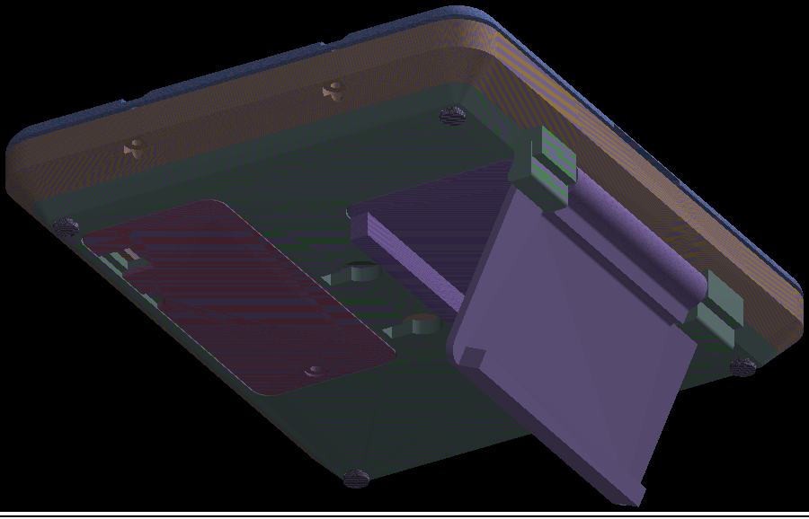
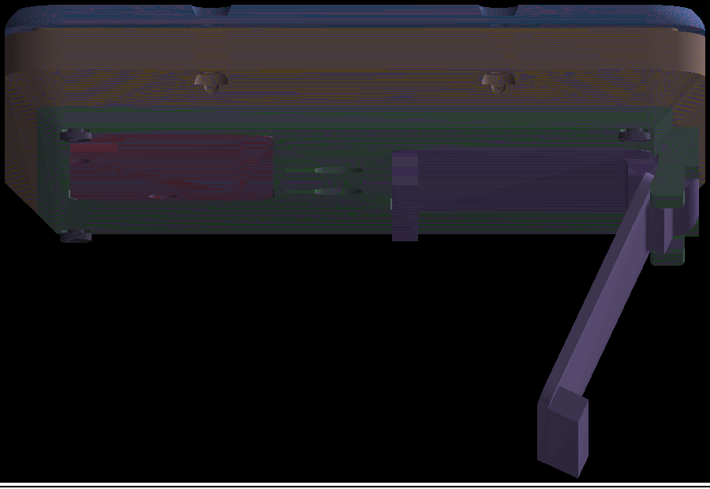

# Aether — Weather Display

A wall-mounted e-ink weather display. An ESP32 drives a 5.76″ 920×680 black-and-white
e-paper panel that shows current conditions, a multi-day forecast, and readings from
Home Assistant — configured from a browser-based layout editor with no code and no
recompiling.

<p align="center">
  
</p>

<p align="center"><em>What the glass shows, captured from the layout editor's preview. Everything on
screen — headings, boxes, dividers, icons and values — is placed by the layout editor below, not
hard-coded in the firmware.</em></p>

<table>
<tr>
<td width="50%"></td>
<td width="50%"></td>
</tr>
<tr>
<td align="center"><em>Case, rear cover and printed hinge (CAD)</em></td>
<td align="center"><em>Side profile with the folding kickstand (CAD)</em></td>
</tr>
</table>

Built by **OETSolutions**.

---

## What it is

The device fetches weather from OpenWeatherMap and readings from Home Assistant, draws
them onto an e-ink panel that keeps its image even when unpowered, and serves its own
configuration web app. You point a browser at the display's IP address, arrange the
layout visually, and save — the device stores the layout and redraws.

It runs two ways:

- **Mains / always-on** — stays awake, serves the web app, and refreshes on a schedule.
- **Battery** — wakes on an interval, fetches, redraws, and goes back to deep sleep.

Power source is detected automatically from the battery voltage, and can be overridden.

## Features

- **Visual layout editor** in the browser — drag, resize and bind value boxes on a
  to-scale 920×680 canvas that shows the real 1-bit output.
- **Live preview with real data** — the editor asks the device what it actually resolved,
  so the preview matches the panel instead of guessing.
- **Two independent refresh cadences** — Home Assistant on a fast interval, OpenWeatherMap
  on a slower one (its data only updates ~every 10 minutes and its free tier is capped).
- **Multiple pages** with scheduled auto-rotation, each page with its own layout and dwell.
- **Data bindings** — OWM current conditions and forecast, Home Assistant entities (REST),
  each with per-field formatting (decimals, prefix/suffix, fallback) and thresholds.
- **Alerts** — user-defined per-field thresholds *and* official OWM severe-weather alerts.
- **Any weather product** — One Call 3.0 or the free Current + 5-day/3-hour endpoints,
  auto-detected from the API key.
- **Partial refresh** — only changed values are redrawn, with a periodic full refresh to
  clear ghosting.
- **Captive-portal and BLE provisioning** — no credentials are ever compiled in.
- **Firmware update over the network**, from GitHub releases or by uploading a `.bin`
  from the browser, with rollback protection.
- **Thermal guard** and a **last-good-image** policy: a failed fetch or an out-of-range
  temperature leaves the previous screen up rather than drawing garbage.

## How the pieces fit together

```
                    ┌─────────────────────────────┐
   browser ────────▶│  config web app (TypeScript) │  layout editor, live preview,
   (editor)         │  runs in browser OR on-device│  credentials, firmware update
                    └──────────────┬──────────────┘
                                   │ REST  (config, artwork, values, OTA)
                    ┌──────────────▼──────────────┐
   internet ───────▶│   ESP32 firmware (ESP-IDF)   │──SPI──▶ e-ink panel 920×680
   OWM, GitHub      │   fetch · render · serve     │
                    └──────────────┬──────────────┘
   Home Assistant ────────────────┘  (REST)
```

The **firmware never invents a position or a label.** The web app renders the static layer
of each page (backgrounds, headings, box outlines, icons) to a 1-bit bitmap and uploads it;
the ESP32 stores it and stamps only the *changing values* on top at each refresh. That means
a layout change ships instantly — no firmware rebuild — while the device keeps full control
of what it draws.

## Repository layout

```
eink_weather/
├── code/
│   ├── firmware/            ESP-IDF project (PlatformIO), C
│   │   ├── components/      app, api, epd, net, prov, webui, …
│   │   ├── lib/             pure, host-testable logic (datasrc, layout, owmcount, …)
│   │   ├── test/            ~510 host unit tests (run on your Mac, no hardware)
│   │   ├── tools/           generators (fonts, icons, QR, boot logo) and bench scripts
│   │   ├── assets/          generated data blobs
│   │   └── platformio.ini   pinned ESP-IDF 5.5.x toolchain
│   ├── webapp/              layout config app (TypeScript, Vite)
│   │   └── src/             model, canvas/editor, ui, transfer, presets
│   ├── docs/                spec + implementation plan
│   └── tools/               fixture / secret-header generators
├── work/                    CAD (FreeCAD), FPC and datasheet study, case renders
└── docs/images/             images used by this README
```

## Building

### Firmware

```sh
cd code/firmware
pio run                     # build
pio run -t upload           # flash over USB
pio test -e native          # host unit tests (no hardware needed)
```

ESP-IDF **5.5.x** is pinned in `platformio.ini` (both the framework and the platform —
floating either one breaks the build on a clean machine). The app image is ~1.8 MB, and
**the embedded web app shares the OTA slot**, so its size is budgeted and checked at build
time.

Secrets (WiFi, OWM key, HA URL/token) are **never compiled in** — they are entered on the
device (captive portal or BLE app) and stored in NVS. A per-machine header is generated
from a gitignored file for bench use only.

### Web app

```sh
cd code/webapp
npm install
npm run dev                                   # dev server, proxies /api to the device
npm run build:device                          # build + embed into ESP32 flash
EINK_DEVICE=http://192.168.2.34 npm run dev   # point the proxy at a device
```

The built app is embedded in the firmware, so **a web-app change is not live on the device
until you rebuild and reflash** — `npm run build:device` regenerates the embedded bundle,
which the next firmware build picks up.

### Flashing a running device over the network

Three ways, depending on the situation:

| Method | Use it when |
|---|---|
| `pio run -t upload` | The board is on USB. |
| `POST /api/firmware` | You have a `firmware.bin` and the device is on the LAN. |
| `POST /api/ota/update` | You published a GitHub release and want the device to pull it. |

The LAN upload takes the raw image over HTTP:

```sh
curl --data-binary @.pio/build/esp32dev/firmware.bin http://<device-ip>/api/firmware
```

Both network paths leave the new image **on probation**: the bootloader reverts to the
previous image unless the new one both boots *and* completes a refresh. Both are gated by
the optional access token (they replace firmware — a device takeover otherwise).

## Configuration

Open `http://<device-ip>/` in a browser. The editor covers:

- **Location** — a map picker for exact coordinates, plus an optional zip code.
- **Layout** — the canvas editor: value boxes, dividers, headings, background pictures.
- **Pages** — rotation order, per-page dwell, and the two refresh cadences.
- **Weather product** — auto / One Call 3.0 / free endpoints.
- **Credentials** — OWM key and Home Assistant URL/token (stored on the device).
- **Access** — an optional token that gates every mutating request.
- **Firmware** — check for updates, or upload a `.bin` directly.

### The two refresh cadences

Two numbers, deliberately separate:

- **Refresh Home Assistant every (seconds)** — how often the device wakes and redraws.
  Home Assistant is your own server, so this can be as short as you like.
- **Refresh weather data every (seconds)** — how often the weather is re-fetched.
  OpenWeatherMap publishes new data only about every 10 minutes and its free tier allows
  1000 calls a day, so fetching it on every wake wastes the quota on values that have not
  changed. Between weather fetches the display keeps its last readings.

A weather interval shorter than the Home Assistant one is not possible and is raised to
match it.

## Status

Complete and running on hardware. The firmware passes ~510 host tests and the web app ~220;
both are gated in CI, which also blocks releases. Firmware updates from GitHub releases are
verified end-to-end, and an image can be flashed over the LAN or by uploading it from the
browser.

## Specification

The full requirements and the implementation plan live in
[`code/docs/specs/`](code/docs/specs/) and [`code/docs/plans/`](code/docs/plans/).
